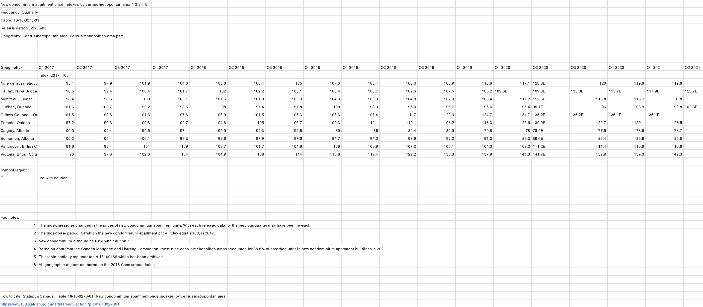
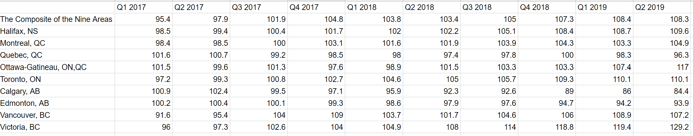
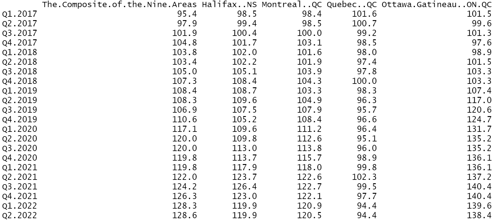
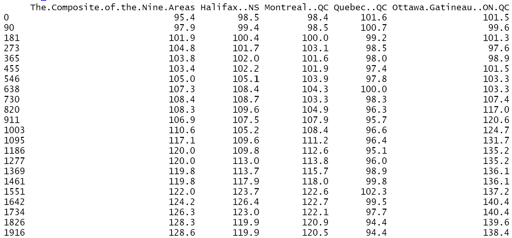
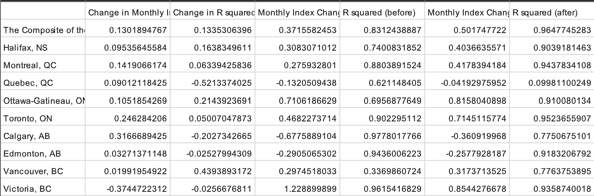
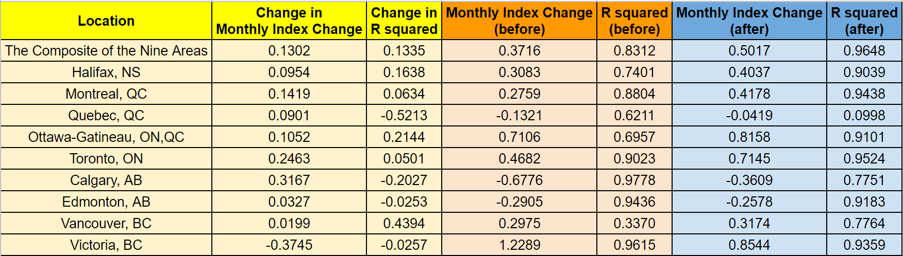
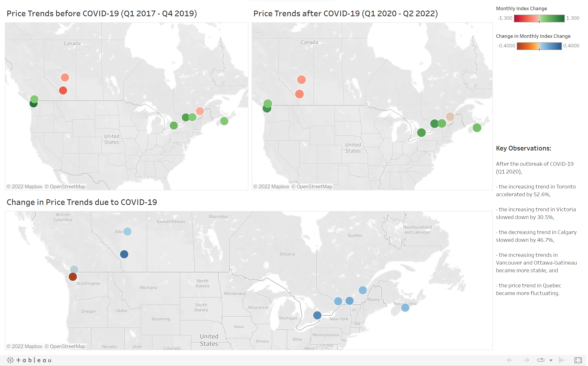

# Impact of COVID-19 on New Condo Prices in Canada
## Introduction
According to [Statistics Canada](https://www150.statcan.gc.ca/n1/pub/11-627-m/11-627-m2020050-eng.pdf), the price of condo apartments increased at a faster pace than the price of homes prior to COVID-19. It is predicted that people will opt to live in the suburbs instead of cities.
<br/>
<br/>
To investigate further the impact of COVID-19 on Canadian condo apartment market, the project aims to find out the patterns of the price trends in different regions. Therefore, the project analyzes the Quarterly New Condominium Apartment Price Indexes, by cenusus metropolitan area (Statistics Canada, 2022) using linear regressions in R and visualizes the results using Tableau.
<br/>
<br/>

## Codes
Before using R, the data is first cleaned using spreadsheet by performing the following actions:
- remove the rows of headings, footnotes and legends
- remove the character "E" in some of the indexes in the table to ensure they are in the form of integers
- rename the columns of locations by changing some special characters into English characters and using abbreviations for provinces
<br/>
Uncleaned

Cleaned

<br/>
After that, install the necessary packages to R.

```r
install.packages("ggplot2")
library(ggplot2)
install.packages("ggpubr")
library(ggpubr)
```
<br/>
Read the price index data into a dataframe in long format. Also, get vectors of quarters and locations.

```r
#Read new condo price data
data_dir <- "../New Condo Price Data (Cleaned).csv"
condo_data <- read.csv(file=data_dir, row.names=1)

#Get vectors of quarters and locations
quarters <- colnames(condo_data)
locations <- rownames(condo_data)

#Convert the data in long format
condo_data <- data.frame(t(condo_data))
```

<br/>
Since linear regression requires both variable (time and price indexes) to be numeric, convert the quarters into number of days since 01/01/2017, which is the first date of the base year of the data.

```r
#Convert quarters into days
days <- c()
for (quarter in quarters) {
  if (substr(quarter,1,2) == "Q1"){
    day <- as.Date(paste("01-01-",substr(quarter,4,7),sep=""), format="%d-%m-%Y")
  }
  else if (substr(quarter,1,2) == "Q2"){
    day <- as.Date(paste("01-04-",substr(quarter,4,7),sep=""), format="%d-%m-%Y")
  }
  else if (substr(quarter,1,2) == "Q3"){
    day <- as.Date(paste("01-07-",substr(quarter,4,7),sep=""), format="%d-%m-%Y")
  }
  else if (substr(quarter,1,2) == "Q4"){
    day <- as.Date(paste("01-10-",substr(quarter,4,7),sep=""), format="%d-%m-%Y")
  }
  days <- c(days, day)
}
days <- days - days[1]
rownames(condo_data) <- days
```

<br/>
Besides, specify the date of the outbreak of COVID-19 to be 01-01-2020.

```r
outbreak_quarter <- "Q1.2020"
outbreak_day <- as.Date("01-01-2020",format="%d-%m-%Y") - as.Date("01-01-2017",format="%d-%m-%Y")
outbreak_index <- which(quarters==outbreak_quarter)
```
<br/>
Explore the price trends in different areas using scatter plots.

```r
for (i in 1:length(locations)){
  print(
    ggplot(condo_data, aes(x=days,y=condo_data[,i]))+
      labs(x="",y="Price Index", title=paste("New Condo Price Trend in",locations[i]))+
      geom_point()+
      geom_smooth()+
      scale_x_continuous(breaks=days,labels=quarters)+
      ylim(min(condo_data), max(condo_data))+
      theme(axis.text.x=element_text(angle=90,vjust=0.5,hjust=1))+
      geom_vline(xintercept=outbreak_day,linetype="dotted",color="red",size=1.5)+
      annotate(geom="text", x=outbreak_day-200, y=145, label="Outbreak of COVID-19", color="red")
    )
  ggsave(filename=paste(locations[i],".png",sep=""), width=10, height=5)
}
```


<br/>

From the above plots, we can see some general insights about the price such as increasing trends in Toronto and Vancouver, stable trend in Quebec and flattening trend in Victoria. However, to get quantitative understandings, linear regressions need to be performed.
<br/>
<br/>
For each area, two linear regressions, before and after the outbreak, are used to model the price trends. The slope coefficient and R squared are recorded for the comparison on the strengths and stabilities of the trends.

```r
slope_before <- c()
slope_after <- c()
slope_change <- c()
r_sq_before <- c()
r_sq_after <- c()
r_sq_change <- c()
for (i in 1:length(locations)){
  LR_before <- lm(formula=condo_data[1:outbreak_index-1,i]~days[1:outbreak_index-1])
  LR_after <- lm(formula=condo_data[-outbreak_index+1:0,i]~days[-outbreak_index+1:0])
  slope_before <- c(slope_before, summary(LR_before)$coefficient[2,1]*30)
  slope_after <- c(slope_after, summary(LR_after)$coefficient[2,1]*30)
  slope_change <- c(slope_change, tail(slope_after,1)-tail(slope_before,1))
  r_sq_before <- c(r_sq_before, summary(LR_before)$adj.r.squared)
  r_sq_after <- c(r_sq_after, summary(LR_after)$adj.r.squared)
  r_sq_change <- c(r_sq_change, tail(r_sq_after,1)-tail(r_sq_before,1))
}
```
<br/>
Export the results.

```r
results <- data.frame(slope_change, r_sq_change, slope_before, r_sq_before, slope_after, r_sq_after, row.names=locations)
colnames(results) <- c('Change in Monthly Index Change', 'Change in R squared','Monthly Index Change (before)', 'R squared (before)', 'Monthly Index Change (after)', 'R squared (after)')
write.csv(results,"../Price Trends.csv", row.names = TRUE)
```

<br/>
To make the results more readible, the csv file is convert to a spreadsheet and the data are color-coded.

<br/>
To relate the results with geographical factors, an interactive dashboard is developed and the findings are presented on maps using Tableau.

View the dashboard [here](https://public.tableau.com/views/ImpactofCOVID-19onNewCondoPricesinCanada/Dashboard?:language=en-US&:display_count=n&:origin=viz_share_link).
<br/>

<br/>

## References
Statistics Canada (2022). Table 18-10-0273-01  New condominium apartment price indexes, by census metropolitan area. DOI: https://doi.org/10.25318/1810027301-eng
